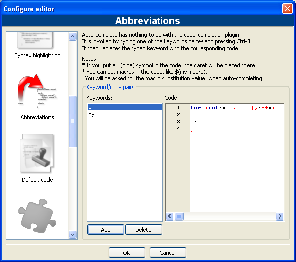

# ([C++](Cpp.md)) [Abbreviation](CppAbbreviation.md)

In the [Code::Blocks](CppCodeBlocks.md) IDE, 
an [abbreviation](CppAbbreviation.md) is a way 
to quickly insert predefined text by using an abbreviation.

The use of [abbreviations](CppAbbreviation.md) is similar to 
[C++ Builder](CppBuilder.md)'s [Code Templates](CppCodeTemplate.md).
