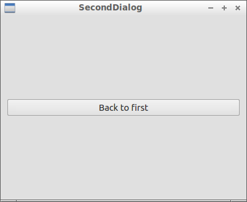

 

 

 

 

 

([C++](Cpp.htm))  [Exercise: Qt hide and show \#1](CppExerciseQtHideAndShow1.htm)
=================================================================================================

 

Difficulty: 2/10

Date added: 14th of October 2012

 

In this [exercise](CppExercise.htm) I will show an [error](CppError.htm)
I have wrestled with for some weeks, with the goal to prevent you having
the same trouble. I will assume some basic [Qt](CppQt.htm) knowledge.

 

I desired to have the following program flow:

-   On startup, the first dialog shows:\
    
-   On the first dialog, pressing the button with the text 'Show
    second', results in **hiding the first** and showing the second
    dialog:\
    
-   On the second dialog, pressing the button with the text 'Back to
    first', results in closing the second dialog and showing the first
    dialog

 

I want to hide the first dialog when showing the second dialog. This
prevent the user from needlessly seeing the older dialog.

 

Also note that the program returns an exit code of zero, which denotes
that the program ended without an error.

 

 

 

 

Question
--------

 

The code shown below, however, ends the program when pressing 'Back to
first'. Why?

 

The solution can really be found in the code shown.

 

Note that the -from my point of- unexpected behavior is actually the
expected behavior, according to [this bug
report](https://bugreports.qt-project.org/browse/QTBUG-3657).

 

-   [Download the Qt Creator project
    'CppExerciseQtHideAndShow1' (zip)](CppExerciseQtHideAndShow1.zip)
-   [View the answer](CppExerciseQtHideAndShow1Answer.htm)

 

 

 

 

 

Code
----

 

[Qt project file](CppQtProjectFile.htm): CppExerciseQtHideAndShow1.pro
----------------------------------------------------------------------

 

  ---------------------------------------------------------------------------------------------------------------------------------------------------------------------------------------------------------------------------------------------------------------------
  ` QT       += core gui TARGET = CppExercise: Qt hide and show #1 TEMPLATE = app SOURCES += \     main.cpp\     firstdialog.cpp \     seconddialog.cpp HEADERS  +=  \     firstdialog.h \     seconddialog.h FORMS    += \     firstdialog.ui \     seconddialog.ui`
  ---------------------------------------------------------------------------------------------------------------------------------------------------------------------------------------------------------------------------------------------------------------------

 

 

 

 

 

firstdialog.h
-------------

 

  ------------------------------------------------------------------------------------------------------------------------------------------------------------------------------------------------------------------------------------------------------------------------------------------------------------------------------------------------------------------
  ` #ifndef FIRSTDIALOG_H #define FIRSTDIALOG_H  #include <QDialog>  namespace Ui { class FirstDialog; }  class FirstDialog : public QDialog {     Q_OBJECT      public:     explicit FirstDialog(QWidget *parent = 0);     ~FirstDialog();      private slots:     void on_pushButton_clicked();  private:     Ui::FirstDialog *ui; };  #endif // FIRSTDIALOG_H `
  ------------------------------------------------------------------------------------------------------------------------------------------------------------------------------------------------------------------------------------------------------------------------------------------------------------------------------------------------------------------

 

 

 

 

 

firstdialog.cpp
---------------

 

  ------------------------------------------------------------------------------------------------------------------------------------------------------------------------------------------------------------------------------------------------------------------------------------------------------------------------------------------------------------------------
  ` #include "seconddialog.h" #include "firstdialog.h" #include "ui_firstdialog.h"  FirstDialog::FirstDialog(QWidget *parent) :     QDialog(parent),     ui(new Ui::FirstDialog) {   ui->setupUi(this); }  FirstDialog::~FirstDialog() {     delete ui; }  void FirstDialog::on_pushButton_clicked() {   SecondDialog d;   this->hide();   d.exec();   this->show(); } `
  ------------------------------------------------------------------------------------------------------------------------------------------------------------------------------------------------------------------------------------------------------------------------------------------------------------------------------------------------------------------------

 

 

 

 

 

main.cpp
--------

 

  ------------------------------------------------------------------------------------------------------------------------------------------------------------
  ` #include <QtGui/QApplication> #include "firstdialog.h"  int main(int argc, char *argv[]) {   QApplication a(argc, argv);   FirstDialog w;   w.exec(); }`
  ------------------------------------------------------------------------------------------------------------------------------------------------------------

 

 

 

 

 

seconddialog.h
--------------

 

  --------------------------------------------------------------------------------------------------------------------------------------------------------------------------------------------------------------------------------------------------------------------------------------------------------------------------------------------------------------------------
  ` #ifndef SECONDDIALOG_H #define SECONDDIALOG_H  #include <QDialog>  namespace Ui { class SecondDialog; }  class SecondDialog : public QDialog {     Q_OBJECT      public:     explicit SecondDialog(QWidget *parent = 0);     ~SecondDialog();      private slots:     void on_pushButton_clicked();  private:     Ui::SecondDialog *ui; };  #endif // SECONDDIALOG_H `
  --------------------------------------------------------------------------------------------------------------------------------------------------------------------------------------------------------------------------------------------------------------------------------------------------------------------------------------------------------------------------

 

 

 

 

 

seconddialog.cpp
----------------

 

  -------------------------------------------------------------------------------------------------------------------------------------------------------------------------------------------------------------------------------------------------------------------------------------------------
  ` #include "seconddialog.h" #include "ui_seconddialog.h"  SecondDialog::SecondDialog(QWidget *parent) :     QDialog(parent),     ui(new Ui::SecondDialog) {   ui->setupUi(this); }  SecondDialog::~SecondDialog() {   delete ui; }  void SecondDialog::on_pushButton_clicked() {   close(); } `
  -------------------------------------------------------------------------------------------------------------------------------------------------------------------------------------------------------------------------------------------------------------------------------------------------

 

 

 

 

 

 

This page has been created by the [tool](Tools.htm)
[CodeToHtml](ToolCodeToHtml.htm)
