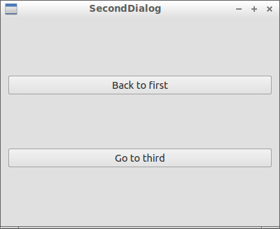

[Go back to Richel Bilderbeek's C++ page](Cpp.htm).

 

 

 

 

 

([C++](Cpp.htm))  [Exercise: Qt hide and show \#2](CppExerciseQtHideAndShow2.htm)
=================================================================================================

 

Difficulty: 2/10

Date added: 14th of October 2012

 

In this [exercise](CppExercise.htm) I will show an [error](CppError.htm)
I have wrestled with for some weeks, with the goal to prevent you having
the same trouble. I will assume some basic [Qt](CppQt.htm) knowledge.

 

I desired to have the following program flow:

-   On startup, the first dialog shows:\
    
-   On the first dialog, pressing the button with the text 'Show
    second', results in **hiding the first** and showing the second
    dialog:\
    
-   On the second dialog, pressing the button with the text 'Back to
    first', results in going back to the first dialog\
-   On the second dialog, pressing the button with the text 'Go to
    third', results in **hiding the second** and showing the third
    dialog:\
    
-   On the third dialog, pressing the button with the text 'Back to
    first', results in going back to the first dialog.
-   On the third dialog, pressing the button with the text 'Back to
    second', results in going back to the second dialog.

 

I want to hide a dialog when showing another. This prevent the user from
needlessly seeing the older dialog.

 

Also note that the program returns an exit code of zero, which denotes
that the program ended without an error.

 

 

 

 

Question
--------

 

The code shown below, however, has an incorrect flow: from the third
dialog, the user is always taken back to the first dialog. Why?

 

It is checked that the if statement in SecondDialog really takes the
correct branch.

If the if-statement in SecondDialog is replaced by 'this-&gt;show()',
the incorrect behavior persists.

The solution can really be found in the code shown.

Note that the -from my point of- unexpected behavior is actually the
expected behavior, according to [this bug
report](https://bugreports.qt-project.org/browse/QTBUG-3657).

 

-   [Download the Qt Creator project
    'CppExerciseQtHideAndShow2' (zip)](CppExerciseQtHideAndShow2.zip)
-   [View the answer](CppExerciseQtHideAndShow2Answer.htm)
-   [The forum this question is posted
    on](https://qt-project.org/forums/viewthread/21102)

 

 

 

 

 

Code
----

 

[Qt project file](CppQtProjectFile.htm): CppExerciseQtHideAndShow2.pro
----------------------------------------------------------------------

 

  ------------------------------------------------------------------------------------------------------------------------------------------------------------------------------------------------------------------------------------------------------------------------------------------------------------------------------
  ` QT       += core gui TARGET = CppExerciseQtHideAndShow2 TEMPLATE = app SOURCES += \     main.cpp\     firstdialog.cpp \     seconddialog.cpp \     thirddialog.cpp HEADERS  +=  \     firstdialog.h \     seconddialog.h \     thirddialog.h FORMS    += \     firstdialog.ui \     seconddialog.ui \     thirddialog.ui `
  ------------------------------------------------------------------------------------------------------------------------------------------------------------------------------------------------------------------------------------------------------------------------------------------------------------------------------

 

 

 

 

 

firstdialog.h
-------------

 

  ------------------------------------------------------------------------------------------------------------------------------------------------------------------------------------------------------------------------------------------------------------------------------------------------------------------------------------------------------------------
  ` #ifndef FIRSTDIALOG_H #define FIRSTDIALOG_H  #include <QDialog>  namespace Ui { class FirstDialog; }  class FirstDialog : public QDialog {     Q_OBJECT      public:     explicit FirstDialog(QWidget *parent = 0);     ~FirstDialog();      private slots:     void on_pushButton_clicked();  private:     Ui::FirstDialog *ui; };  #endif // FIRSTDIALOG_H `
  ------------------------------------------------------------------------------------------------------------------------------------------------------------------------------------------------------------------------------------------------------------------------------------------------------------------------------------------------------------------

 

 

 

 

 

firstdialog.cpp
---------------

 

  ------------------------------------------------------------------------------------------------------------------------------------------------------------------------------------------------------------------------------------------------------------------------------------------------------------------------------------------------------------------------
  ` #include "seconddialog.h" #include "firstdialog.h" #include "ui_firstdialog.h"  FirstDialog::FirstDialog(QWidget *parent) :     QDialog(parent),     ui(new Ui::FirstDialog) {   ui->setupUi(this); }  FirstDialog::~FirstDialog() {     delete ui; }  void FirstDialog::on_pushButton_clicked() {   SecondDialog d;   this->hide();   d.exec();   this->show(); } `
  ------------------------------------------------------------------------------------------------------------------------------------------------------------------------------------------------------------------------------------------------------------------------------------------------------------------------------------------------------------------------

 

 

 

 

 

main.cpp
--------

 

  -------------------------------------------------------------------------------------------------------------------------------------------------------------------------
  ` #include <QtGui/QApplication> #include "firstdialog.h"  int main(int argc, char *argv[]) {   QApplication a(argc, argv);   FirstDialog w;   w.show();   a.exec(); } `
  -------------------------------------------------------------------------------------------------------------------------------------------------------------------------

 

 

 

 

 

seconddialog.h
--------------

 

  ------------------------------------------------------------------------------------------------------------------------------------------------------------------------------------------------------------------------------------------------------------------------------------------------------------------------------------------------------------------------------------------------------------------------------
  ` #ifndef SECONDDIALOG_H #define SECONDDIALOG_H  #include <QDialog>  namespace Ui { class SecondDialog; }  class SecondDialog : public QDialog {     Q_OBJECT      public:     explicit SecondDialog(QWidget *parent = 0);     ~SecondDialog();      private slots:     void on_button_goto_third_clicked();      void on_button_back_to_first_clicked();  private:     Ui::SecondDialog *ui; };  #endif // SECONDDIALOG_H `
  ------------------------------------------------------------------------------------------------------------------------------------------------------------------------------------------------------------------------------------------------------------------------------------------------------------------------------------------------------------------------------------------------------------------------------

 

 

 

 

 

seconddialog.cpp
----------------

 

  ------------------------------------------------------------------------------------------------------------------------------------------------------------------------------------------------------------------------------------------------------------------------------------------------------------------------------------------------------------------------------------------------------------------------------------------------------------------------------------------------------------------------------------------------------------
  ` #include <cassert> #include "seconddialog.h" #include "ui_seconddialog.h" #include "thirddialog.h"  SecondDialog::SecondDialog(QWidget *parent) :     QDialog(parent),     ui(new Ui::SecondDialog) {   ui->setupUi(this); }  SecondDialog::~SecondDialog() {   delete ui; }  void SecondDialog::on_button_back_to_first_clicked() {   close(); }  void SecondDialog::on_button_goto_third_clicked() {   ThirdDialog d;   this->hide();   d.exec();   if (d.m_back_to_which_dialog == 1)   {     this->close();   }   else   {     this->show();   } } `
  ------------------------------------------------------------------------------------------------------------------------------------------------------------------------------------------------------------------------------------------------------------------------------------------------------------------------------------------------------------------------------------------------------------------------------------------------------------------------------------------------------------------------------------------------------------

 

 

 

 

 

thirddialog.h
-------------

 

  --------------------------------------------------------------------------------------------------------------------------------------------------------------------------------------------------------------------------------------------------------------------------------------------------------------------------------------------------------------------------------------------------------------------------------------------------------
  ` #ifndef THIRDDIALOG_H #define THIRDDIALOG_H  #include <QDialog>  namespace Ui { class ThirdDialog; }  class ThirdDialog : public QDialog {     Q_OBJECT       public:     explicit ThirdDialog(QWidget *parent = 0);     ~ThirdDialog();      int m_back_to_which_dialog;  private slots:     void on_button_back_to_first_clicked();      void on_button_back_to_second_clicked();  private:     Ui::ThirdDialog *ui; };  #endif // THIRDDIALOG_H `
  --------------------------------------------------------------------------------------------------------------------------------------------------------------------------------------------------------------------------------------------------------------------------------------------------------------------------------------------------------------------------------------------------------------------------------------------------------

 

 

 

 

 

thirddialog.cpp
---------------

 

  ----------------------------------------------------------------------------------------------------------------------------------------------------------------------------------------------------------------------------------------------------------------------------------------------------------------------------------------------------------------------------------------------------------------------------------------------------------------------------------------------------------------------------------------
  ` #include "thirddialog.h" #include "ui_thirddialog.h"  ThirdDialog::ThirdDialog(QWidget *parent) :     QDialog(parent),     m_back_to_which_dialog(2), //When user closes the dialog, go back to the previous/second dialog     ui(new Ui::ThirdDialog) {   ui->setupUi(this); }  ThirdDialog::~ThirdDialog() {   delete ui; }  void ThirdDialog::on_button_back_to_first_clicked() {   m_back_to_which_dialog = 1;   close(); }  void ThirdDialog::on_button_back_to_second_clicked() {   m_back_to_which_dialog = 2;   close(); } `
  ----------------------------------------------------------------------------------------------------------------------------------------------------------------------------------------------------------------------------------------------------------------------------------------------------------------------------------------------------------------------------------------------------------------------------------------------------------------------------------------------------------------------------------------

 

 

 

 

 

[Go back to Richel Bilderbeek's C++ page](Cpp.htm).

 

[{width="88"
height="31"}](http://validator.w3.org/check?uri=referer)

This page has been created by the [tool](Tools.htm)
[CodeToHtml](ToolCodeToHtml.htm)
