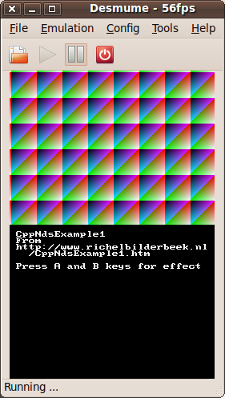

# ([C++](Cpp.md))  [NDS example 1](CppNdsExample1.md)

[NDS](CppNds.md) example 1: 2D pixel art, respond to keys.



 * [Download the Qt Creator project 'CppNdsExample1' (zip)](CppNdsExample1.zip)

## [Operating system(s) or programming environment(s)](CppOs.md)
 *  [NDS](CppNds.md)
 *  [Ubuntu](CppUbuntu.md) 10.04 LTS Lucid Lynx

[IDE(s)](CppIde.md):

 *  command line
 *  [Qt Creator](CppQtCreator.md) 2.0.0

[Project type](CppQtProjectType.md):

 *  Console application
 *  [GUI](CppGui.md) application

[Compiler(s)](CppCompiler.md):

 * [g++](CppGpp.md) 4.4.1

[Libraries](CppLibrary.md) used:

 *  [libnds](CppLibnds.md): version 1.4.7
 *  [STL](CppStl.md): from [GCC](CppGcc.md), shipped with [Qt Creator](CppQt.md) 2.0.0


## [Qt project file](CppQtProjectFile.md)

 
```c++
#-------------------------------------------------
#
# Project created by QtCreator 2010-10-07T22:25:11
#
#-------------------------------------------------
INCLUDEPATH += /opt/devkitpro/libnds-1.4.7/include
INCLUDEPATH += /opt/devkitpro/libnds-src-1.4.7/include/nds

INCLUDEPATH += /opt/devkitpro/devkitARM/arm-eabi/include
LIBS += -L/opt/devkitpro/libnds-1.4.7/lib -lnds9
LIBS += -L/opt/devkitpro/devkitARM/arm-eabi/lib -lstdc++
DEFINES += ARM9
TARGET = CppNdsExample1
CONFIG   += console
CONFIG -= qt
CONFIG   -= app_bundle
TEMPLATE = app
SOURCES += main.cpp
QMAKE_CC = /opt/devkitpro/devkitARM/bin/arm-eabi-g++
QMAKE_CXX = /opt/devkitpro/devkitARM/bin/arm-eabi-g++
QMAKE_LINK = /opt/devkitpro/devkitARM/bin/arm-eabi-g++
QMAKE_LFLAGS = -T/opt/devkitpro/devkitARM/arm-eabi/lib/ds_arm9.ld
```

## `main.cpp`


```c++
#include <nds.h>
#include <iostream>

int main()
{
  //Initialization
  consoleDemoInit();
  videoSetMode(MODE_FB0);
  vramSetBankA(VRAM_A_LCD);

  std::cout
    << "\n"
    << " CppNdsExample1\n"
    << " From\n"
    << " http://www.richelbilderbeek.nl\n"
    << "   /CppNdsExample1.htm\n"
    << "\n"
    << " Press A and B keys for effect\n";

  //The maximum x coordinat
  const int maxx = 256;
  //The maximum y coordinat
  const int maxy = 192;
  //The maximum R/G/B color value
  const int max_color = 32;
  //Counter for the scroll effect
  int z = 0;

  while(1)
  {
    //Respond to keys
    scanKeys();
    const int held = keysHeld();
    if (!held) continue;
    if (held & KEY_A) ++z;
    if (held & KEY_B) { --z; if (z<0) z+=max_color; }
    for (int y=0; y!=maxy; ++y)
    {
      for (int x=0; x!=maxx; ++x)
      {
        VRAM_A[(y*maxx)+x]
          = RGB15(
            (x+z  ) % max_color,
            (y+z  ) % max_color,
            (x+y+z) % max_color);
      }
    }
  }
}
```

## [Makefile](CppMakefile.md)

```c++
#---------------------------------------------------------------------------------
.SUFFIXES:
#---------------------------------------------------------------------------------

ifeq ($(strip $(DEVKITARM)),)
$(error "Please set DEVKITARM in your environment. export DEVKITARM=<path to>devkitARM")
endif

include $(DEVKITARM)/ds_rules

#---------------------------------------------------------------------------------
# TARGET is the name of the output
# BUILD is the directory where object files & intermediate files will be placed
# SOURCES is a list of directories containing source code
# INCLUDES is a list of directories containing extra header files
#---------------------------------------------------------------------------------
TARGET := $(shell basename $(CURDIR))
BUILD := build
SOURCES := gfx source data  
INCLUDES := include build /opt/devkitpro/libnds-1.4.7/include

#---------------------------------------------------------------------------------
# options for code generation
#---------------------------------------------------------------------------------
ARCH := -mthumb -mthumb-interwork

CFLAGS := -g -Wall -O2\
-march=armv5te -mtune=arm946e-s -fomit-frame-pointer\
-ffast-math \
$(ARCH)

CFLAGS += $(INCLUDE) -DARM9
CXXFLAGS := $(CFLAGS) -fno-rtti -fno-exceptions

ASFLAGS := -g $(ARCH)
LDFLAGS = -specs=ds_arm9.specs -g $(ARCH) -mno-fpu -Wl,-Map,$(notdir $*.map)

#---------------------------------------------------------------------------------
# any extra libraries we wish to link with the project
#---------------------------------------------------------------------------------
LIBS := -lnds9


#---------------------------------------------------------------------------------
# list of directories containing libraries, this must be the top level containing
# include and lib
#---------------------------------------------------------------------------------
LIBDIRS := $(LIBNDS)

#---------------------------------------------------------------------------------
# no real need to edit anything past this point unless you need to add additional
# rules for different file extensions
#---------------------------------------------------------------------------------
ifneq ($(BUILD),$(notdir $(CURDIR)))
#---------------------------------------------------------------------------------

export OUTPUT := $(CURDIR)/$(TARGET)

export VPATH := $(foreach dir,$(SOURCES),$(CURDIR)/$(dir))
export DEPSDIR := $(CURDIR)/$(BUILD)

CFILES := $(foreach dir,$(SOURCES),$(notdir $(wildcard $(dir)/*.c)))
CPPFILES := $(foreach dir,$(SOURCES),$(notdir $(wildcard $(dir)/*.cpp)))
SFILES := $(foreach dir,$(SOURCES),$(notdir $(wildcard $(dir)/*.s)))
BINFILES := $(foreach dir,$(SOURCES),$(notdir $(wildcard $(dir)/*.bin)))

#---------------------------------------------------------------------------------
# use CXX for linking C++ projects, CC for standard C
#---------------------------------------------------------------------------------
ifeq ($(strip $(CPPFILES)),)
#---------------------------------------------------------------------------------
export LD := $(CC)
#---------------------------------------------------------------------------------
else
#---------------------------------------------------------------------------------
export LD := $(CXX)
#---------------------------------------------------------------------------------
endif
#---------------------------------------------------------------------------------

export OFILES := $(BINFILES:.bin=.o) \
$(CPPFILES:.cpp=.o) $(CFILES:.c=.o) $(SFILES:.s=.o)

export INCLUDE := $(foreach dir,$(INCLUDES),-I$(CURDIR)/$(dir)) \
$(foreach dir,$(LIBDIRS),-I$(dir)/include) \
$(foreach dir,$(LIBDIRS),-I$(dir)/include) \
-I$(CURDIR)/$(BUILD)

export LIBPATHS := $(foreach dir,$(LIBDIRS),-L$(dir)/lib)

.PHONY: $(BUILD) clean

#---------------------------------------------------------------------------------
$(BUILD):
@[ -d $@ ] || mkdir -p $@
@make --no-print-directory -C $(BUILD) -f $(CURDIR)/Makefile

#---------------------------------------------------------------------------------
clean:
@echo clean ...
@rm -fr $(BUILD) $(TARGET).elf $(TARGET).nds $(TARGET).ds.gba


#---------------------------------------------------------------------------------
else

DEPENDS := $(OFILES:.o=.d)

#---------------------------------------------------------------------------------
# main targets
#---------------------------------------------------------------------------------
$(OUTPUT).nds : $(OUTPUT).elf
$(OUTPUT).elf : $(OFILES)

#---------------------------------------------------------------------------------
%.o : %.bin
#---------------------------------------------------------------------------------
@echo $(notdir $<)
$(bin2o)


-include $(DEPENDS)

#---------------------------------------------------------------------------------------
endif
#---------------------------------------------------------------------------------------
``` 

## [Make](CppMake.md)

This project is made from command line, using the
[makefile](CppMakefile.md) shown above.
