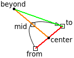

 

 

 

 

 

([C++](Cpp.htm))  [QGraphicsPathItem example 5: Bezier quadratic lines with arrow heads](CppQGraphicsPathItemExample5.htm)
==========================================================================================================================================

 

[QGraphicsPathItem example 5: Bezier quadratic lines with arrow
heads](CppQGraphicsPathItemExample5.htm) is a
[QGraphicsPathItem](CppQGraphicsPathItem.htm) example. This example
shows how to use [QGraphicsRectItems](CppQGraphicsRectItem.htm) to
manipulatie [QGraphicsPathItems](CppQGraphicsPathItem.htm), resulting in
quadratic Bezier curves.

 

-   [View a screenshot of
    'CppQGraphicsPathItemExample5' (png)](CppQGraphicsPathItemExample5.png)
-    [Download the Qt Creator project
    'CppQGraphicsPathItemExample5' (zip)](CppQGraphicsPathItemExample5.zip)
-    [Download a Windows executable of
    'CppQGraphicsPathItemExample5' (zip)](CppQGraphicsPathItemExample5Exe.zip)

 

 

 

 

 

The math
--------

 

 

The arrow can be manipulated by three rectangles, called 'from', 'mid'
and 'to'. To let the quadratic Bezier curve go through 'mid', it uses
'beyond' as its hinge point. 'beyond' is the mirror point of 'center',
using 'mid' as the mirror. 'center' is the point between 'from' and
'to'.

 

 

 

 

 

Technical facts
---------------

 

[Application type(s)](CppApplication.htm)

-    [Desktop
    application](CppDesktopApplication.htm)

[Operating system(s) or programming environment(s)](CppOs.htm)

-    [Lubuntu](CppLubuntu.htm) 12.10 (quantal)

[IDE(s)](CppIde.htm):

-    [Qt Creator](CppQtCreator.htm) 2.5.2

[Project type](CppQtProjectType.htm):

-    [GUI application](CppGuiApplication.htm)

[C++ standard](CppStandard.htm):

-    [C++11](Cpp11.htm)

[Compiler(s)](CppCompiler.htm):

-   [G++](CppGpp.htm) 4.7.2

[Libraries](CppLibrary.htm) used:

-    [Qt](CppQt.htm): version 4.8.3 (32 bit)
-    [STL](CppStl.htm): GNU ISO C++ Library, version
    4.7.2

 

 

 

 

 

[Qt project file](CppQtProjectFile.htm): CppQGraphicsPathItemExample5.pro
-------------------------------------------------------------------------

 

  -----------------------------------------------------------------------------------------------------------------------------------------------------------------------------------------------------------------------------------------------------------------------------------------------
  ` QT       += core gui QMAKE_CXXFLAGS += -std=c++11 -Wall -Wextra -Werror TARGET = CppQGraphicsPathItemExample5 TEMPLATE = app  SOURCES += \     qtmain.cpp \     qtwidget.cpp \     qtpathitem.cpp \     qtrectitem.cpp  HEADERS += \     qtwidget.h \     qtpathitem.h \     qtrectitem.h `
  -----------------------------------------------------------------------------------------------------------------------------------------------------------------------------------------------------------------------------------------------------------------------------------------------

 

 

 

 

 

qtmain.cpp
----------

 

  -----------------------------------------------------------------------------------------------------------------------------------------------------------------------------------------------------------------------------------------------------------------------------------------------------------------------------------------------------------------------------------------------------------------------------------------------------------------------------------------------------------------------------------------------------
  ` #ifdef _WIN32 //See http://www.richelbilderbeek.nl/CppCompileErrorSwprintfHasNotBeenDeclared.htm #undef __STRICT_ANSI__ #endif  #include <QApplication> #include <QDesktopWidget> #include "qtwidget.h"  int main(int argc, char *argv[]) {   QApplication a(argc, argv);   QtWidget w;   {     //Resize the dialog and put it in the screen center     w.setGeometry(0,0,600,400);     const QRect screen = QApplication::desktop()->screenGeometry();     w.move( screen.center() - w.rect().center() );   }   w.show();   return a.exec(); } `
  -----------------------------------------------------------------------------------------------------------------------------------------------------------------------------------------------------------------------------------------------------------------------------------------------------------------------------------------------------------------------------------------------------------------------------------------------------------------------------------------------------------------------------------------------------

 

 

 

 

 

qtpathitem.h
------------

 

  --------------------------------------------------------------------------------------------------------------------------------------------------------------------------------------------------------------------------------------------------------------------------------------------------------------------------------------------------------------------------------------------------------------------------------------------------------------------------------------------------------------------------------------------------------------------------------------------------------------------------------------------------------------------------------------------------------------------------------------------------------------------------------------------------------------------------------------------------------------------------------------------------------------------------------------------------------------------------------------------------------------------------------------------------------------------------------------------------------------------------------------------------------------------------------------------------------------------------------------------------------------------------------------------------------------------------------------------------------------------------------------------------------------------------------------------------------------------------------------------------------------------------------------------------------------------------------------------------------------------------------------------------------------------------------------------------------------------------------------------------------------------------------------------------------------------------------------------------------------------------------------------------------------------------------------------------------------------------------------------------------------------------------------------------------------------------------------------------------------------------------------------------------------------------------------------------------------------------------------------------------------------
  ` #ifndef QTPATHITEM_H #define QTPATHITEM_H  #include <QGraphicsPathItem>  struct QtRectItem;  struct QtPathItem : public QGraphicsItem {   QtPathItem(     const QtRectItem * const from,     const bool tail,     const QtRectItem * const mid,     const bool head,     const QtRectItem * const to,     QGraphicsItem *parent = 0, QGraphicsScene *scene = 0);    ///Respond to key press   void keyPressEvent(QKeyEvent *event);    ///Respond to mouse press   void mousePressEvent(QGraphicsSceneMouseEvent *event);     protected:   ///Change the cursor when the user moves the mouse cursor in the bounding rectangle   void hoverEnterEvent(QGraphicsSceneHoverEvent *event);    ///The rectangle that containg the item, used for rough calculations like   ///collision detection   QRectF boundingRect() const;    ///Paint a QtPathItem   void paint(QPainter *painter, const QStyleOptionGraphicsItem *, QWidget *);    ///More precise shape compared to boundingRect   ///In this example, it is redefined to ease selecting those thin lines   QPainterPath shape() const;    private:   ///The extra width given to the line for easier clicking   static const double m_click_easy_width;    ///The item where the arrow originates from   const QtRectItem * const m_from;    ///Show arrow at head   bool m_head;    ///The item where the arrow pass through in the middle   const QtRectItem * const m_mid;    ///Show arrow at tail   bool m_tail;    ///The item where the arrow points to   ///(would the arrow and tail heads not be reversible)   const QtRectItem * const m_to;    ///Obtain the angle in radians between two deltas   ///12 o'clock is 0.0 * pi   /// 3 o'clock is 0.5 * pi   /// 6 o'clock is 1.0 * pi   /// 9 o'clock is 1.5 * pi   //From www.richelbilderbeek.nl/CppGetAngle.htm   static double GetAngle(const double dx, const double dy);    ///Obtain point 'beyond'   QPointF GetBeyond() const;    ///Obtain point 'center'   QPointF GetCenter() const;    ///Obtain the head point of the arrow, on the edge of the rectangle m_from   QPointF GetHead() const;    ///Obtain the tail point of the arrow, on the edge of the rectangle m_from   QPointF GetTail() const; };  #endif // QTPATHITEM_H `
  --------------------------------------------------------------------------------------------------------------------------------------------------------------------------------------------------------------------------------------------------------------------------------------------------------------------------------------------------------------------------------------------------------------------------------------------------------------------------------------------------------------------------------------------------------------------------------------------------------------------------------------------------------------------------------------------------------------------------------------------------------------------------------------------------------------------------------------------------------------------------------------------------------------------------------------------------------------------------------------------------------------------------------------------------------------------------------------------------------------------------------------------------------------------------------------------------------------------------------------------------------------------------------------------------------------------------------------------------------------------------------------------------------------------------------------------------------------------------------------------------------------------------------------------------------------------------------------------------------------------------------------------------------------------------------------------------------------------------------------------------------------------------------------------------------------------------------------------------------------------------------------------------------------------------------------------------------------------------------------------------------------------------------------------------------------------------------------------------------------------------------------------------------------------------------------------------------------------------------------------------------------------

 

 

 

 

 

qtpathitem.cpp
--------------

 

  --------------------------------------------------------------------------------------------------------------------------------------------------------------------------------------------------------------------------------------------------------------------------------------------------------------------------------------------------------------------------------------------------------------------------------------------------------------------------------------------------------------------------------------------------------------------------------------------------------------------------------------------------------------------------------------------------------------------------------------------------------------------------------------------------------------------------------------------------------------------------------------------------------------------------------------------------------------------------------------------------------------------------------------------------------------------------------------------------------------------------------------------------------------------------------------------------------------------------------------------------------------------------------------------------------------------------------------------------------------------------------------------------------------------------------------------------------------------------------------------------------------------------------------------------------------------------------------------------------------------------------------------------------------------------------------------------------------------------------------------------------------------------------------------------------------------------------------------------------------------------------------------------------------------------------------------------------------------------------------------------------------------------------------------------------------------------------------------------------------------------------------------------------------------------------------------------------------------------------------------------------------------------------------------------------------------------------------------------------------------------------------------------------------------------------------------------------------------------------------------------------------------------------------------------------------------------------------------------------------------------------------------------------------------------------------------------------------------------------------------------------------------------------------------------------------------------------------------------------------------------------------------------------------------------------------------------------------------------------------------------------------------------------------------------------------------------------------------------------------------------------------------------------------------------------------------------------------------------------------------------------------------------------------------------------------------------------------------------------------------------------------------------------------------------------------------------------------------------------------------------------------------------------------------------------------------------------------------------------------------------------------------------------------------------------------------------------------------------------------------------------------------------------------------------------------------------------------------------------------------------------------------------------------------------------------------------------------------------------------------------------------------------------------------------------------------------------------------------------------------------------------------------------------------------------------------------------------------------------------------------------------------------------------------------------------------------------------------------------------------------------------------------------------------------------------------------------------------------------------------------------------------------------------------------------------------------------------------------------------------------------------------------------------------------------------------------------------------------------------------------------------------------------------------------------------------------------------------------------------------------------------------------------------------------------------------------------------------------------------------------------------------------------------------------------------------------------------------------------------------------------------------------------------------------------------------------------------------------------------------------------------------------------------------------------------------------------------------------------------------------------------------------------------------------------------------------------------------------------------------------------------------------------------------------------------------------------------------------------------------------------------------------------------------------------------------------------------------------------------------------------------------------------------------------------------------------------------------------------------------------------------------------------------------------------------------------------------------------------------------------------------------------------------------------------------------------------------------------------------------------------------------------------------------------------------------------------------------------------------------------------------------------------------------------------------------------------------------------------------------------------------------------------------------------------------------------------------------------------------------------------------------------------------------------------------------------------------------------------------------------------------------------------------------------------------------------------------------------------------------------------------------------------------------------------------------------------------------------------------------------------------------------------------------------------------------------------------------------------------------------------------------------------------------------------------------------------------------------------------------------------------------------------------------------------------------------------------------------------------------------------------------------------------------------------------------------------------------------------------------------------------------------------------------------------------------------------------------------------------------------------------------------------------------------------------------------------------------------------------------------------------------------------------------------------------------------------------------------------------------------------------------------------------------------------------------------------------------------------------------------------------------------------------------------------------------------------------------------------------------------------------------------------------------------------------------------------------------------------------------------------------------------------------------------------------------------------------------------------------------------------------------------------------------------------------------------------------------------------------------------------------------------------------------------------------------------------------------------------------------------------------------------------------------------------------------------------------------------------------------------------------------------------------------------------------------------------------------------------------------------------------------------------------------------------------------------------------------------------------------------------------------------------------------------------------------------------------------------------------------------------------------------------------------------------------------------------------------------------------------------------------------------------------------------------------------------------------------------------------------------------------------------------------------------------------------------------------------------------------------------------------------------------------------------------------------------------------------------------------------------------------------------------------------------------------------------------------------------------------------------------------------------------------------------------------------------------------------------------------------------------------------------------------------------------------------------------------------------------------------------------------------------------------------------------------------------------------------------------------------------------------------------------------------------------------------------------------------------------------------------------------------------------------------------------------------------------------------------------------------------------------------------------------------------------------------------------------------------------------------------------------------------------------------------------------------------------------------------------------------------------------------------------------------------------------------------------------------------------------------------------------------------------------------------------------------------------------------------------------------------------------------------------------------------------------------------------------------------------------------------------------------------------------------------------------------------------------------------------------------------------------------------------------------------------------------------------------------------------------------------------------------------------------------------------------------------------------------------------------------------------------------------------------------------------------------------------------------------------------------------------------------------------------------------------------------------------------------------------------------------------------------------------------------------
  ` #ifdef _WIN32 //See http://www.richelbilderbeek.nl/CppCompileErrorSwprintfHasNotBeenDeclared.htm #undef __STRICT_ANSI__ #endif  //#include own header file as first substantive line of code, from: // * John Lakos. Large-Scale C++ Software Design. 1996. ISBN: 0-201-63362-0. Section 3.2, page 110 #include "qtpathitem.h"  #include <cassert> #include <cmath>  #include <QCursor> #include <QGraphicsSceneMouseEvent> #include <QKeyEvent> #include <QPainter>  #include "qtrectitem.h"  #include <boost/geometry.hpp> #include <boost/geometry/geometries/linestring.hpp> #include <boost/geometry/geometries/point_xy.hpp>  ///Obtain the zero or one intersections between two finite lines //From http://www.richelbilderbeek.nl/CppGetLineLineIntersections.htm template <class T> const std::vector<   boost::geometry::model::d2::point_xy<T> > GetLineLineIntersections(   const boost::geometry::model::linestring<     boost::geometry::model::d2::point_xy<T>   > line1,   const boost::geometry::model::linestring<     boost::geometry::model::d2::point_xy<T>   > line2) {   typedef boost::geometry::model::d2::point_xy<T> Point;   typedef boost::geometry::model::linestring<Point> Line;   std::vector<Point> points;   boost::geometry::intersection(line1,line2,points);   assert(points.empty() || points.size() == 1);   return points; }  //Helper function to create a const line without a temporary std::vector template <class T> const boost::geometry::model::linestring<boost::geometry::model::d2::point_xy<T> > CreateLine(const std::vector<boost::geometry::model::d2::point_xy<T> >& v) {   return boost::geometry::model::linestring<     boost::geometry::model::d2::point_xy<T>   >(v.begin(),v.end()); }  ///Obtain the zero, one or two intersections between a line and a rectanle //From http://www.richelbilderbeek.nl/CppGetLineRectIntersections.htm template <class T> const std::vector<   boost::geometry::model::d2::point_xy<T> > GetLineRectIntersections(   const boost::geometry::model::linestring<     boost::geometry::model::d2::point_xy<T>   > line,   const boost::geometry::model::box<     boost::geometry::model::d2::point_xy<T>   > rect) {   typedef boost::geometry::model::d2::point_xy<T> Point;   typedef boost::geometry::model::linestring<Point> Line;   typedef boost::geometry::model::box<Point> Rect;    const Point p0 = Point(rect.min_corner().x(), rect.min_corner().y());   const Point p1 = Point(rect.max_corner().x(), rect.min_corner().y());   const Point p2 = Point(rect.min_corner().x(), rect.max_corner().y());   const Point p3 = Point(rect.max_corner().x(), rect.max_corner().y());   const std::vector<Line> lines     =     {       CreateLine(std::vector<Point>( {p0,p1} )),       CreateLine(std::vector<Point>( {p0,p2} )),       CreateLine(std::vector<Point>( {p1,p3} )),       CreateLine(std::vector<Point>( {p2,p3} ))     };   std::vector<Point> points;   std::for_each(lines.begin(),lines.end(),     [&points,line](const Line& side)     {       const std::vector<Point> v = GetLineLineIntersections(line,side);       std::copy(v.begin(),v.end(),std::back_inserter(points));     }   );   //Remove doublures   //Put 'typename' before 'std::vector<Point>::iteratortype' to prevent getting the error below:   //error: need 'typename' before 'std::vector<boost::geometry::model::d2::point_xy<T> >::iterator'   //  because 'std::vector<boost::geometry::model::d2::point_xy<T> >' is a dependent scope   typename std::vector<Point>::iterator new_end = std::unique( points.begin(),points.end(),          {       return lhs.x() == rhs.x() && lhs.y() == rhs.y();     }   );   points.erase(new_end,points.end());    assert(points.size() <= 2);    return points; }   const double QtPathItem::m_click_easy_width = 10.0;  QtPathItem::QtPathItem(   const QtRectItem * const from,   const bool tail,   const QtRectItem * const mid,   const bool head,   const QtRectItem * const to,   QGraphicsItem *parent, QGraphicsScene *scene)   : QGraphicsItem(parent,scene),     m_from(from),     m_head(head),     m_mid(mid),     m_tail(tail),     m_to(to) {   this->setFlags(QGraphicsItem::ItemIsSelectable);    assert(!(flags() & QGraphicsItem::ItemIsMovable) );   assert( (flags() & QGraphicsItem::ItemIsSelectable) );    //Accept enterHoverEvents   this->setAcceptHoverEvents(true);    //Put this arrow item under the rect   this->setZValue(mid->zValue() - 1.0); }  QRectF QtPathItem::boundingRect() const {   return shape().boundingRect(); }  double QtPathItem::GetAngle(const double dx, const double dy) {   return M_PI - (std::atan(dx/dy)); }  QPointF QtPathItem::GetBeyond() const {   const QPointF center = GetCenter();   const double dx_mid_center = m_mid->pos().x() - center.x();   const double dy_mid_center = m_mid->pos().y() - center.y();   const QPointF beyond(center.x() + dx_mid_center + dx_mid_center, center.y() + dy_mid_center + dy_mid_center);   return beyond; }  QPointF QtPathItem::GetCenter() const {   const QPointF center((m_from->pos() + m_to->pos()) / 2.0);   return center; }  QPointF QtPathItem::GetHead() const {   typedef boost::geometry::model::d2::point_xy<double> Point;   typedef boost::geometry::model::linestring<Point> Line;   typedef boost::geometry::model::box<Point> Rect;    const QPointF beyond = GetBeyond();    const Line line_head = CreateLine(     std::vector<Point>(       {         Point(beyond.x(),beyond.y()),         Point(m_to->pos().x(),m_to->pos().y()),       }     )   );    const QRectF qr_to = m_to->boundingRect().translated(m_to->pos());    const Rect r_to(     Point(qr_to.topLeft().x()    ,qr_to.topLeft().y()    ),     Point(qr_to.bottomRight().x(),qr_to.bottomRight().y())     );     std::vector<Point> p_head_end = GetLineRectIntersections(line_head,r_to);   if (p_head_end.empty())   {     p_head_end.push_back(Point(m_to->pos().x(),m_to->pos().y()));     //Yes,it happens, when the line does not leave the rectangle     //this happens when the two node rectanges overlap   }   assert(!p_head_end.empty());   assert(p_head_end.size() == 1);   return QPointF(p_head_end[0].x(),p_head_end[0].y()); }  QPointF QtPathItem::GetTail() const {   typedef boost::geometry::model::d2::point_xy<double> Point;   typedef boost::geometry::model::linestring<Point> Line;   typedef boost::geometry::model::box<Point> Rect;    const QPointF beyond = GetBeyond();    const Line line_tail = CreateLine(     std::vector<Point>(       {         Point(m_from->pos().x(),m_from->pos().y()),         Point(beyond.x(),beyond.y()),       }     )   );    const QRectF qr_from = m_from->boundingRect().translated(m_from->pos());    const Rect r_from(     Point(qr_from.topLeft().x()    ,qr_from.topLeft().y()    ),     Point(qr_from.bottomRight().x(),qr_from.bottomRight().y())     );    std::vector<Point> p_tail_end = GetLineRectIntersections(line_tail,r_from);   if (p_tail_end.empty())   {     //Yes,it happens, when the line does not leave the rectangle     //this happens when the two node rectanges overlap     p_tail_end.push_back(Point(m_from->pos().x(),m_from->pos().y()));   }   assert(!p_tail_end.empty());   assert(p_tail_end.size() == 1);   return QPointF(p_tail_end[0].x(),p_tail_end[0].y()); }  void QtPathItem::hoverEnterEvent(QGraphicsSceneHoverEvent *) {   this->setCursor(QCursor(Qt::PointingHandCursor)); }  void QtPathItem::keyPressEvent(QKeyEvent *event) {   switch (event->key())   {     case Qt::Key_F1:     case Qt::Key_1:     case Qt::Key_T:     case Qt::Key_Minus:       m_tail = !m_tail;       this->update();       break;     case Qt::Key_F2:     case Qt::Key_2:     case Qt::Key_H:     case Qt::Key_Plus:       m_head = !m_head;       this->update();       break;     default:       break;   }   QGraphicsItem::keyPressEvent(event); }  void QtPathItem::mousePressEvent(QGraphicsSceneMouseEvent *event) {   if (event->modifiers() & Qt::ShiftModifier)   {     if ((event->pos() - this->m_from->pos()).manhattanLength() < 10.0)     {       m_tail = !m_tail;       this->update();     }     else if ((event->pos() - this->m_to->pos()).manhattanLength() < 10.0)     {       m_head = !m_head;       this->update();     }   }   QGraphicsItem::mousePressEvent(event); }   void QtPathItem::paint(QPainter *painter, const QStyleOptionGraphicsItem *, QWidget *) {   painter->setRenderHint(QPainter::Antialiasing);    if (this->isSelected())   {     const QColor color(255,0,0);     QPen pen;     pen.setColor(color);     pen.setWidth(3);     painter->setPen(pen);   }   else   {     const QColor color(0,0,0);     QPen pen;     pen.setColor(color);     pen.setWidth(1);     painter->setPen(pen);   }      //Line must go _though_ mid pos, instead of using it as a virtual hinge point   //Solution:   // - define point 'center' as the middle between from and to   // - define point 'beyond' as the mirror point of 'center', using mid_pos as a mirror   const QPointF beyond = GetBeyond();   const QPointF p_tail_end = GetTail();   const QPointF p_head_end = GetHead();    QPainterPath curve;   curve.moveTo(p_tail_end);   curve.quadTo(beyond,p_head_end);   painter->drawPath(curve);    {     const double sz = 10.0; //pixels     if (m_tail)     {       //The angle from midpoint to tail       //Thanks goes out to Toine van den Bogaart and Theo van den Bogaart for being happy to help with the math       const double dx = beyond.x() - m_from->pos().x();       const double dy = beyond.y() - m_from->pos().y();       double angle = GetAngle(dx,dy);       if (dy >= 0.0) angle = (1.0 * M_PI) + angle;       const QPointF p0(p_tail_end.x(),p_tail_end.y());       const QPointF p1         = p0 + QPointF(            std::sin(angle + M_PI + (M_PI * 0.1)) * sz,           -std::cos(angle + M_PI + (M_PI * 0.1)) * sz);       const QPointF p2         = p0 + QPointF(            std::sin(angle + M_PI - (M_PI * 0.1)) * sz,           -std::cos(angle + M_PI - (M_PI * 0.1)) * sz);       painter->drawPolygon(QPolygonF() << p0 << p1 << p2);     }     if (m_head)     {       //The angle from midpoint to head       //Thanks goes out to Toine van den Bogaart and Theo van den Bogaart for being happy to help with the math       const double dx = m_to->pos().x() - beyond.x();       const double dy = m_to->pos().y() - beyond.y();       double angle = GetAngle(dx,dy);       if (dy >= 0.0) angle = (1.0 * M_PI) + angle;        const QPointF p0(p_head_end.x(),p_head_end.y());       const QPointF p1         = p0 + QPointF(            std::sin(angle +  0.0 + (M_PI * 0.1)) * sz,           -std::cos(angle +  0.0 + (M_PI * 0.1)) * sz);       const QPointF p2         = p0 + QPointF(            std::sin(angle +  0.0 - (M_PI * 0.1)) * sz,           -std::cos(angle +  0.0 - (M_PI * 0.1)) * sz);        painter->drawPolygon(QPolygonF() << p0 << p1 << p2);     }   } }  QPainterPath QtPathItem::shape() const {   const QPointF beyond = GetBeyond();   const QPointF p_tail_end = GetTail();   const QPointF p_head_end = GetHead();    QPainterPath curve;   curve.moveTo(p_tail_end);   curve.quadTo(beyond,p_head_end);    QPainterPathStroker stroker;   stroker.setWidth(m_click_easy_width);   return stroker.createStroke(curve); } `
  --------------------------------------------------------------------------------------------------------------------------------------------------------------------------------------------------------------------------------------------------------------------------------------------------------------------------------------------------------------------------------------------------------------------------------------------------------------------------------------------------------------------------------------------------------------------------------------------------------------------------------------------------------------------------------------------------------------------------------------------------------------------------------------------------------------------------------------------------------------------------------------------------------------------------------------------------------------------------------------------------------------------------------------------------------------------------------------------------------------------------------------------------------------------------------------------------------------------------------------------------------------------------------------------------------------------------------------------------------------------------------------------------------------------------------------------------------------------------------------------------------------------------------------------------------------------------------------------------------------------------------------------------------------------------------------------------------------------------------------------------------------------------------------------------------------------------------------------------------------------------------------------------------------------------------------------------------------------------------------------------------------------------------------------------------------------------------------------------------------------------------------------------------------------------------------------------------------------------------------------------------------------------------------------------------------------------------------------------------------------------------------------------------------------------------------------------------------------------------------------------------------------------------------------------------------------------------------------------------------------------------------------------------------------------------------------------------------------------------------------------------------------------------------------------------------------------------------------------------------------------------------------------------------------------------------------------------------------------------------------------------------------------------------------------------------------------------------------------------------------------------------------------------------------------------------------------------------------------------------------------------------------------------------------------------------------------------------------------------------------------------------------------------------------------------------------------------------------------------------------------------------------------------------------------------------------------------------------------------------------------------------------------------------------------------------------------------------------------------------------------------------------------------------------------------------------------------------------------------------------------------------------------------------------------------------------------------------------------------------------------------------------------------------------------------------------------------------------------------------------------------------------------------------------------------------------------------------------------------------------------------------------------------------------------------------------------------------------------------------------------------------------------------------------------------------------------------------------------------------------------------------------------------------------------------------------------------------------------------------------------------------------------------------------------------------------------------------------------------------------------------------------------------------------------------------------------------------------------------------------------------------------------------------------------------------------------------------------------------------------------------------------------------------------------------------------------------------------------------------------------------------------------------------------------------------------------------------------------------------------------------------------------------------------------------------------------------------------------------------------------------------------------------------------------------------------------------------------------------------------------------------------------------------------------------------------------------------------------------------------------------------------------------------------------------------------------------------------------------------------------------------------------------------------------------------------------------------------------------------------------------------------------------------------------------------------------------------------------------------------------------------------------------------------------------------------------------------------------------------------------------------------------------------------------------------------------------------------------------------------------------------------------------------------------------------------------------------------------------------------------------------------------------------------------------------------------------------------------------------------------------------------------------------------------------------------------------------------------------------------------------------------------------------------------------------------------------------------------------------------------------------------------------------------------------------------------------------------------------------------------------------------------------------------------------------------------------------------------------------------------------------------------------------------------------------------------------------------------------------------------------------------------------------------------------------------------------------------------------------------------------------------------------------------------------------------------------------------------------------------------------------------------------------------------------------------------------------------------------------------------------------------------------------------------------------------------------------------------------------------------------------------------------------------------------------------------------------------------------------------------------------------------------------------------------------------------------------------------------------------------------------------------------------------------------------------------------------------------------------------------------------------------------------------------------------------------------------------------------------------------------------------------------------------------------------------------------------------------------------------------------------------------------------------------------------------------------------------------------------------------------------------------------------------------------------------------------------------------------------------------------------------------------------------------------------------------------------------------------------------------------------------------------------------------------------------------------------------------------------------------------------------------------------------------------------------------------------------------------------------------------------------------------------------------------------------------------------------------------------------------------------------------------------------------------------------------------------------------------------------------------------------------------------------------------------------------------------------------------------------------------------------------------------------------------------------------------------------------------------------------------------------------------------------------------------------------------------------------------------------------------------------------------------------------------------------------------------------------------------------------------------------------------------------------------------------------------------------------------------------------------------------------------------------------------------------------------------------------------------------------------------------------------------------------------------------------------------------------------------------------------------------------------------------------------------------------------------------------------------------------------------------------------------------------------------------------------------------------------------------------------------------------------------------------------------------------------------------------------------------------------------------------------------------------------------------------------------------------------------------------------------------------------------------------------------------------------------------------------------------------------------------------------------------------------------------------------------------------------------------------------------------------------------------------------------------------------------------------------------------------------------------------------------------------------------------------------------------------------------------------------------------------------------------------------------------------------------------------------------------------------------------------------------------------------------------------------------------------------------------------------------------------------------------------------------------------------------------------------------------------------------------------------------------------------------------------------------------------------------------------------------------------------------------------

 

 

 

 

 

qtrectitem.h
------------

 

  ---------------------------------------------------------------------------------------------------------------------------------------------------------------------------------------------------------------------------------------------------------------------------------------------------------------------------------------------------------------------------------------
  ` #ifndef QTRECTITEM_H #define QTRECTITEM_H  #include <QGraphicsRectItem> #include <boost/signals2.hpp>  struct QtRectItem : public QGraphicsRectItem {   QtRectItem(QGraphicsItem *parent = 0, QGraphicsScene *scene = 0);    boost::signals2::signal<void()> m_signal_mouse_move;   protected:   void mouseMoveEvent(QGraphicsSceneMouseEvent *event); };  #endif // QTRECTITEM_H `
  ---------------------------------------------------------------------------------------------------------------------------------------------------------------------------------------------------------------------------------------------------------------------------------------------------------------------------------------------------------------------------------------

 

 

 

 

 

qtrectitem.cpp
--------------

 

  -----------------------------------------------------------------------------------------------------------------------------------------------------------------------------------------------------------------------------------------------------------------------------------------------------------------------------------------------------------------------------------------------------------------------------------------------------------------------------------------------------------------------------------------------------------------------------------------------------------------------------------------------------------------------------------------------------------------------------------------------------------------------------
  ` #ifdef _WIN32 //See http://www.richelbilderbeek.nl/CppCompileErrorSwprintfHasNotBeenDeclared.htm #undef __STRICT_ANSI__ #endif  //#include own header file as first substantive line of code, from: // * John Lakos. Large-Scale C++ Software Design. 1996. ISBN: 0-201-63362-0. Section 3.2, page 110 #include "qtrectitem.h"  QtRectItem::QtRectItem(QGraphicsItem *parent, QGraphicsScene *scene)  : QGraphicsRectItem(parent,scene) {   this->setFlags(       QGraphicsItem::ItemIsSelectable     | QGraphicsItem::ItemIsMovable);    const double length = 8;   this->setRect(-length/2.0,-length/2.0,length,length); }  void QtRectItem::mouseMoveEvent(QGraphicsSceneMouseEvent *event) {   m_signal_mouse_move();   QGraphicsRectItem::mouseMoveEvent(event); } `
  -----------------------------------------------------------------------------------------------------------------------------------------------------------------------------------------------------------------------------------------------------------------------------------------------------------------------------------------------------------------------------------------------------------------------------------------------------------------------------------------------------------------------------------------------------------------------------------------------------------------------------------------------------------------------------------------------------------------------------------------------------------------------------

 

 

 

 

 

qtwidget.h
----------

 

  ---------------------------------------------------------------------------------------------------------------------------------------------------------------------------------------------------------------------------------------------------------------------------------------------------------------------------------
  ` #ifndef QTWIDGET_H #define QTWIDGET_H  #include <QGraphicsView>  ///The widget holding the items struct QtWidget : public QGraphicsView {   QtWidget(QWidget *parent = 0);    ///Pass the key presses to the scene items   void keyPressEvent(QKeyEvent *event);    private:   void OnMouseMove(); };  #endif // QTWIDGET_H `
  ---------------------------------------------------------------------------------------------------------------------------------------------------------------------------------------------------------------------------------------------------------------------------------------------------------------------------------

 

 

 

 

 

qtwidget.cpp
------------

 

  ------------------------------------------------------------------------------------------------------------------------------------------------------------------------------------------------------------------------------------------------------------------------------------------------------------------------------------------------------------------------------------------------------------------------------------------------------------------------------------------------------------------------------------------------------------------------------------------------------------------------------------------------------------------------------------------------------------------------------------------------------------------------------------------------------------------------------------------------------------------------------------------------------------------------------------------------------------------------------------------------------------------------------------------------------------------------------------------------------------------------------------------------------------------------------------------------------------------------------------------------------------------------------------------------------------------------------------------------------------------------------------------------------------------------------------------------------------------------------------------------------------------------------------------------------------------------------------------------------------------------------------------------------------------------------------------------------------------------------------------------
  ` #ifdef _WIN32 //See http://www.richelbilderbeek.nl/CppCompileErrorSwprintfHasNotBeenDeclared.htm #undef __STRICT_ANSI__ #endif  //#include own header file as first substantive line of code, from: // * John Lakos. Large-Scale C++ Software Design. 1996. ISBN: 0-201-63362-0. Section 3.2, page 110 #include "qtwidget.h"   #include <cassert> #include <cmath> #include <QGraphicsScene> #include "qtrectitem.h" #include "qtpathitem.h"  QtWidget::QtWidget(QWidget *parent)   : QGraphicsView(new QGraphicsScene,parent) {   const int n_items = 18;   std::vector<QtRectItem *> rects;    for (int i=0; i!=n_items; ++i)   {     const double angle = 2.0 * M_PI * (static_cast<double>(i) / static_cast<double>(n_items));     const double x1 =  std::sin(angle) * 100.0;     const double y1 = -std::cos(angle) * 100.0;     QtRectItem * const rect = new QtRectItem;     rect->setPos(x1,y1);     scene()->addItem(rect);     rects.push_back(rect);     rect->m_signal_mouse_move.connect(       boost::bind(&QtWidget::OnMouseMove,this));   }   for (int i=0; i<n_items-2; i+=3)   {     assert(i + 2 < n_items);     QtPathItem * const item = new QtPathItem(       rects[(i+0) % n_items],       false,       rects[(i+1) % n_items],       true,       rects[(i+2) % n_items]);     scene()->addItem(item);   } }  void QtWidget::keyPressEvent(QKeyEvent *event) {   QList<QGraphicsItem *> v = scene()->selectedItems();   std::for_each(v.begin(),v.end(),     [event](QGraphicsItem * const item)     {       if (QtPathItem * const pathitem = dynamic_cast<QtPathItem *>(item))       {         pathitem->keyPressEvent(event);       }     }   ); }  void QtWidget::OnMouseMove() {   this->scene()->update(); } `
  ------------------------------------------------------------------------------------------------------------------------------------------------------------------------------------------------------------------------------------------------------------------------------------------------------------------------------------------------------------------------------------------------------------------------------------------------------------------------------------------------------------------------------------------------------------------------------------------------------------------------------------------------------------------------------------------------------------------------------------------------------------------------------------------------------------------------------------------------------------------------------------------------------------------------------------------------------------------------------------------------------------------------------------------------------------------------------------------------------------------------------------------------------------------------------------------------------------------------------------------------------------------------------------------------------------------------------------------------------------------------------------------------------------------------------------------------------------------------------------------------------------------------------------------------------------------------------------------------------------------------------------------------------------------------------------------------------------------------------------------------

 

 

 

 

 

crosscompiletowindows.sh
------------------------

 

  --------------------------------------------------------------------------------------------------------------------------------------------------------------------------------------------------------------------------------------------------------------------------------------------
  ` #!/bin/sh #From http://richelbilderbeek.nl/CppQtCrosscompileToWindowsExample15.htm  echo "Cross compiling to Windows: developer version"  echo "1/2: Creating Windows makefile" i686-pc-mingw32-qmake CppQGraphicsPathItemExample5.pro  echo "2/2: making makefile"  make  echo "Done" `
  --------------------------------------------------------------------------------------------------------------------------------------------------------------------------------------------------------------------------------------------------------------------------------------------

 

 

 

 

 

 

This page has been created by the [tool](Tools.htm)
[CodeToHtml](ToolCodeToHtml.htm)
