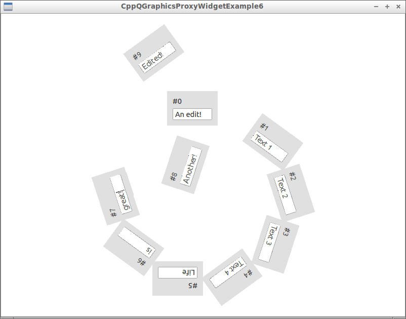
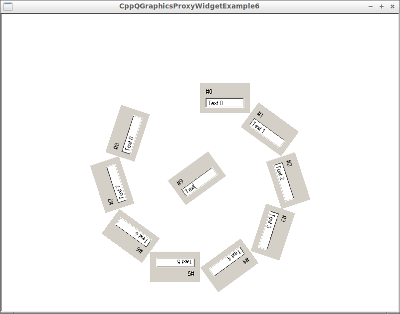

# ([C++](Cpp.md))  [QGraphicsProxyWidget example 6](CppQGraphicsProxyWidgetExample6.md)

[QGraphicsProxyWidget example 6](CppQGraphicsProxyWidgetExample6.md) is
a [QGraphicsProxyWidget](CppQGraphicsProxyWidget.md) example.

This example shows to be able to move the MyItem, even when MyItem has a
focusable QLineEdit.

 *  [Download the Qt Creator project 'CppQGraphicsProxyWidgetExample6' (zip)](CppQGraphicsProxyWidgetExample6.zip)
 *  [Download the Windows executable of 'CppQGraphicsProxyWidgetExample6' (zip)](http://www.richelbilderbeek.nl/CppQGraphicsProxyWidgetExample6Exe.zip)

