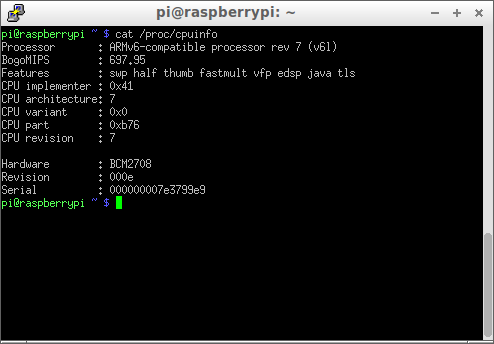

 

 

 

 

 

([C++](Cpp.htm)) [Raspberry Pi](CppRpi.htm)
===========================================

 

My [Raspberry Pi](CppRpi.htm) notes.

 

 

 

 

 

-   [Raspberry Pi example 1: toggle all GPIO pins on and
    off](CppRpiExample1.htm)
-   [Raspberry Pi example 2: turn GPIO pins on and
    off](CppRpiExample2.htm)

 

 

 

 

 

Connecting to RPi via LAN
-------------------------

 

Instead of using a monitor, I connect to the RPi using a router. My
router has an IP address that I visited with a webbrowser. The router's
admin screens showed me that IP adresses were created from IP address
123.456.789. Using the Lubuntu Software Center I downloaded 'Putty ssh
client' and started it with the command 'putty'. Putty requested an IP
address and I entered the router's new IP address start + 1:
123.456.790. Putty showed me a screen with the text: 'login as: '. I
entered 'pi', the default login name. Then it showed 'pi@123.456.790's
password: ' and I entered 'raspberry', the default password.

 

I was in!

 

 

 

 

 

Which board revision do I have?
-------------------------------

 

To check out the board you have, in the command line type:

 

cat /proc/cpuinfo

 

The result I got:

 

 

 

 

 

 

Problem: crosscompile to RPi via Putty
--------------------------------------

 

Perhaps this is not needed: g++ is installed already.

 

 

 

 

 

Problem: RCA to VGA does not appear to work
-------------------------------------------

 

The RPi has an RCA video output (the yellow female port) that I wanted
to connect to a VGA monitor (Nu W512A). In the shop I bought an
RCA-to-VGA wire. This wire, however, had three RCA male connectors in
the colors red, green and blue. Connecting the VGA monitor to the RPi
with any of these RCA males failed

 

Hypothesis: wrong cable, incorrect monitor

 

Solution: try connecting via LAN

 

 

 

 

 

 

This page has been created by the [tool](Tools.htm)
[CodeToHtml](ToolCodeToHtml.htm)
